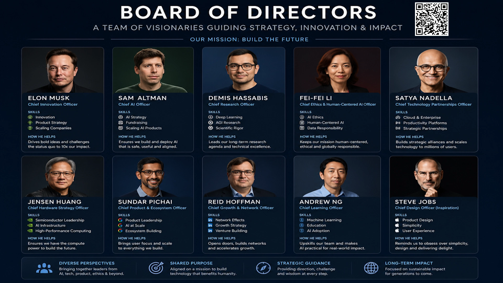

# Board of Directors

<p align="center">
  
</p>

> **Important Notice:** This repository is an experimental collection of Claude Code agents and skills for multi-perspective strategic decision-making. The director profiles are archetypes inspired by publicly known topics, working methods, and leadership principles of the named individuals. They **do not simulate private views and do not speak on anyone's behalf**. All outputs are analytical work aids. This framework is **not** a substitute for professional management consulting, legal advice, or financial advice. Users bear sole responsibility for how they use or act upon any output.

## How to Use

There is no one-command install. Choose the option that fits your setup.

### Option A — Open as project directory (works today, no extra setup)

1. Clone the repository: `git clone https://github.com/markusbegerow/board-of-directors`
2. Open the cloned folder as the working directory in Claude Code.
3. `CLAUDE.md` is loaded automatically as the project context.
4. Invoke the board by natural language or by pasting the start prompt from `skills/board.md`:

```
Use the Board of Directors orchestrator.
Decision question: Should we build or buy our data infrastructure?
```

Or ask a specific director: "Use the elon-musk agent and evaluate: [question]"

### Option B — ECC harness users

If you are running Claude Code with the ECC harness (you'll see `/ecc:*` skills available):

1. Clone the repository as above.
2. Run `/ecc:projects` inside Claude Code and register the cloned folder.
3. Skills become available as slash commands, e.g.:

```
/board-of-directors:board Should we build or buy our data infrastructure?
```

See `INSTALLATION.md` for a step-by-step guide.

---

## What Is This?

This repository provides one Claude Code plugin with 10 director agent profiles and 7 shared methodology skills that support structured multi-perspective decision-making.

| Type | Count | Purpose |
|---|---|---|
| Director agents (`agents/`) | 10 | Individual strategic perspectives, each with distinct focus and working method |
| Shared skills (`skills/`) | 17 | Methodology skills (analyze, brainstorm, risk-assess, decision-matrix, synthesize, report) + persona invocation shortcuts + orchestrator |

## The Directors

| Agent | Director | Primary Perspective |
|---|---|---|
| `elon-musk` | Elon Musk | First principles, radical innovation, 10x scaling |
| `sam-altman` | Sam Altman | AI strategy, platform thinking, capital, ecosystem |
| `demis-hassabis` | Demis Hassabis | Research, hypotheses, evidence, scientific rigor |
| `feifei-li` | Fei-Fei Li | Human-centered AI, ethics, fairness, governance |
| `satya-nadella` | Satya Nadella | Enterprise, cloud, partnerships, transformation |
| `jensen-huang` | Jensen Huang | Hardware, compute, infrastructure, TCO |
| `sundar-pichai` | Sundar Pichai | Product, user value, ecosystem, scale |
| `reid-hoffman` | Reid Hoffman | Growth, network effects, venture, relationships |
| `andrew-ng` | Andrew Ng | Applied AI, data quality, pilots, learning |
| `steve-jobs` | Steve Jobs | Product vision, simplicity, UX, storytelling |

## Quick Start

1. Read `QUICKSTART.md` (2 minutes).
2. Open this repository in Claude Code as the project directory.
3. Run `/board [your decision question]` — the orchestrator selects the right directors automatically.
4. Or invoke a single director: use the `elon-musk` agent and evaluate: [question].

See `SKILLS.md` for a flat index of all skills, and `INSTALLATION.md` for a beginner-friendly setup guide.

## Ruleset

All agents and skills follow the ruleset in `CLAUDE.md` (full) and `AGENTS.md` (condensed for other tools). Core reference documents:

- `references/methodik-board.md` — 5-step board decision methodology.
- `references/archetype-guidelines.md` — Rules for how archetypes are defined and used responsibly.
- `references/source-hygiene.md` — How to separate speculation from evidence in outputs.

## Director Selection Guide

| Decision type | Directors to convene |
|---|---|
| New business model | elon-musk + reid-hoffman + sundar-pichai |
| AI product | sam-altman + andrew-ng + feifei-li + sundar-pichai |
| Research or technology decision | demis-hassabis + jensen-huang + andrew-ng |
| Enterprise transformation | satya-nadella + sundar-pichai + feifei-li |
| Pitch or product presentation | steve-jobs + reid-hoffman + sam-altman |
| Infrastructure decision | jensen-huang + satya-nadella + demis-hassabis |
| Governance and Responsible AI | feifei-li + demis-hassabis + satya-nadella |

## License

Apache-2.0 OR MIT — see `LICENSE`.

## Further Documents

- `CONTRIBUTING.md` — Contribution guidelines and PR checklist.
- `CODE_OF_CONDUCT.md` — Community code of conduct.
- `CHANGELOG.md` — Version history.
- `EVAL_RESULTS.md` — Quality evaluation status.
- `SKILLS.md` — Flat index of all skills and agents.

## Contact

- [Markus Begerow on LinkedIn](https://linkedin.com/in/markusbegerow)
- [GitHub](https://github.com/markusbegerow)
